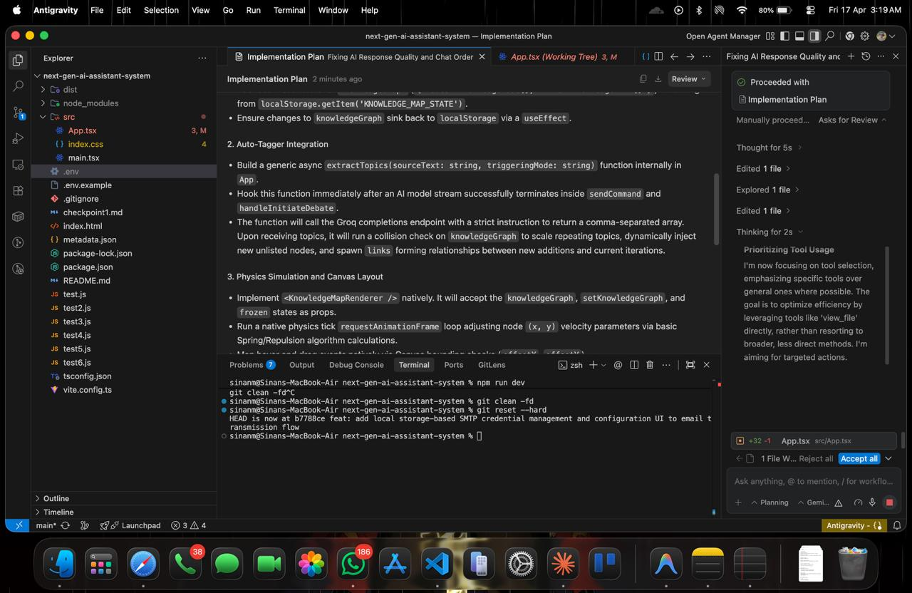
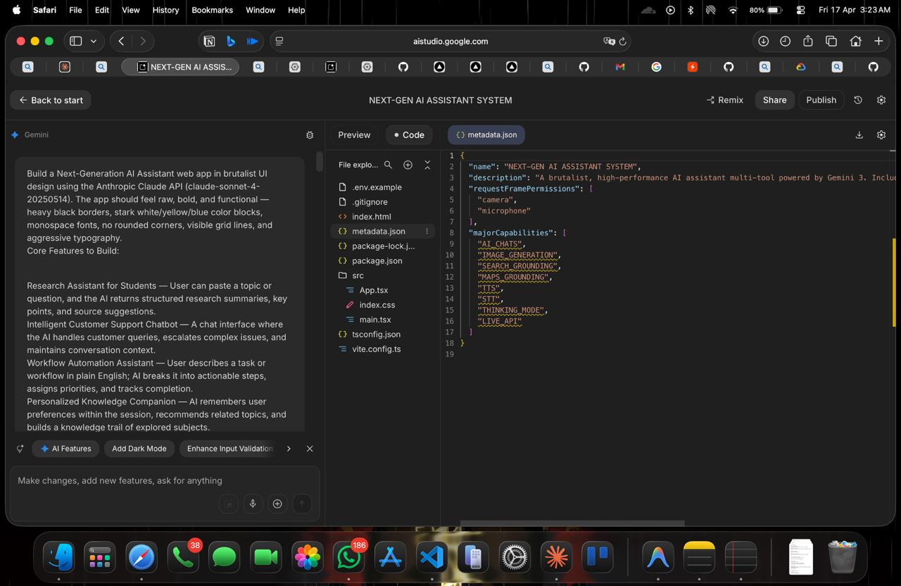
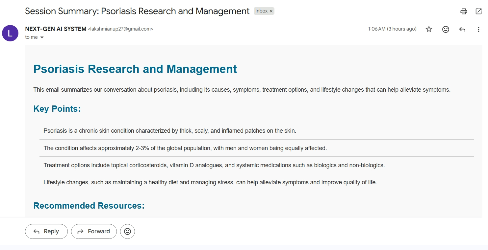

# Project Name
Next-Gen AI Assistant System

## Problem Statement
How might we reduce the cognitive overload and time lost by students, researchers, and professionals who must juggle multiple AI tools, language barriers, and manual workflows — with no single intelligent system that researches, reasons, communicates, and acts on their behalf?

Today's knowledge workers and students face a fragmented digital reality:

They switch between 5–10 different tools just to research a topic, summarize findings, translate content, and share results with teammates or professors.
Existing AI assistants are passive — they answer questions but cannot execute actions, remember context across a session, or adapt their reasoning mode to the task at hand.
Language is a barrier — most AI tools only deliver results in English, excluding millions of non-English-speaking students and researchers from equal access to AI-powered knowledge.
Complex tasks like "research this topic, summarize it, translate it, and email it to my professor" require manual effort across multiple platforms with no automation or intelligent chaining.
There is no single system that can debate an idea, map knowledge visually, run a structured workflow, and remember what you were working on — all in one place.


## Project Description
Describe your solution, how it works, and what makes it useful.


 NEXT-GEN AI ASSISTANT SYSTEM  is a multi-mode, brutalist-designed AI assistant system that goes far beyond a standard chatbot. Built on top of the Groq API with a Node.js backend, it gives users a unified terminal-style command center for research, support, workflow automation, and knowledge building — all powered by large language models in real time.

How It Works:
On first launch, users authenticate with their Groq API key via a secure popup gate. Once inside, the system routes every user query through a specialized system prompt tailored to whichever of the four active modes is selected — Research Assistant, Support Bot, Workflow Automator, or Knowledge Companion. Responses stream back in real time with typewriter rendering at user-controlled speeds.
The app makes intelligent use of multiple sequential and parallel API calls — for example, Debate Mode fires two separate AI instances arguing opposite sides of a topic anda third instance to deliver a verdict, all rendered in a split terminal duel layout. The Fact Checker fires a dedicated verification call against any AI response and returns a color-coded trust report with a calculated reliability score.


What Makes It Useful:
Unlike generic AI chat tools, NEXGEN-AI-TERMINAL is built around real workflows. Students get structured research breakdowns. Support teams get context-aware response drafting. Professionals get plain-English tasks converted into prioritized action pipelines. Every session auto-saves to localStorage, can be exported as a .txt file, and can be dispatched as a formatted HTML email directly from the interface using Gmail SMTP — meaning nothing valuable is ever lost.
The ELI5 vs Expert toggle makes the same AI instantly accessible to both beginners and domain experts. The Mood Detector and Auto Topic Tagger give users a meta-layer of self-awareness about their own queries. Voice input, multi-language support, and Read Aloud output make the system genuinely multimodal.
At its core, NEXGEN-AI-TERMINAL treats the AI not as a search box but as a thinking partner — one that debates, fact-checks itself, adapts its communication style, remembers the session, and delivers results through multiple real-world output channels.

---

## Google AI Usage
Google Studio AI
Google Antigravity
Google Gemini

### Tools / Models Used
Github
Gemini API

### How Google AI Was Used

Google Gemini 1.5 Flash is not a peripheral feature in this project — it is the *core engine* that powers every interaction across the entire application. Here is a precise breakdown of every point where AI is actively integrated:

---

*1. FOUR SPECIALIZED ASSISTANT MODES*
Every tab in the app sends user queries to the Gemini API with a uniquely crafted system prompt that transforms the model's behavior entirely:
- RESEARCH_ASSISTANT — Gemini is prompted to act as an academic research engine, returning structured summaries, key findings, and topic breakdowns
- SUPPORT_BOT — Gemini is prompted as a professional customer service agent maintaining conversation context across turns
- WORKFLOW_AUTO — Gemini receives plain English task descriptions and converts them into prioritized, numbered action pipelines
- KNOWLEDGE_COMPANION — Gemini tracks topics explored within the session and proactively suggests related subjects

---

*2. AI DEBATE MODE*
Three separate sequential Gemini API calls are fired for a single debate topic:
- *Call 1* — Gemini is system-prompted as a passionate PRO advocate and argues strongly in favor of the topic
- *Call 2* — Gemini is system-prompted as a CON advocate and given Call 1's argument as context so it can directly rebut it
- *Call 3* — A neutral Gemini instance reads both arguments and delivers a structured verdict on which side argued more effectively

---

*3. FACT CHECKER*
When the user clicks [VERIFY_FACTS] on any AI response, a dedicated Gemini API call is made. The model is prompted to act as a rigorous fact-checking engine — it extracts every factual claim from the response, classifies each as VERIFIED, UNCERTAIN, or DISPUTED, and returns a structured JSON report. A trust score is calculated from the ratio of verified claims and rendered as a brutalist progress bar.

---

*4. ELI5 / EXPERT TOGGLE*
The active mode injects a dynamic instruction into the Gemini system prompt before every API call — either forcing the model to explain concepts as simply as a bedtime story or respond with the depth and precision of a peer-reviewed academic paper. The same question gets a completely different Gemini response depending on the toggle state.

---

*5. MOOD DETECTOR*
After every user message, a lightweight Gemini API call analyzes the emotional tone of the input and returns a classification tag such as ANXIOUS, CURIOUS, FRUSTRATED, or CONFIDENT — displayed as a colored brutalist label above the AI response.

---

*6. AUTO TOPIC TAGGER*
A parallel Gemini call extracts 2–3 core keyword hashtags from every conversation turn automatically, giving users a live meta-layer of topic awareness displayed below each response as #MEDICAL #RESEARCH #URGENT

---

*7. PROMPT SUGGESTIONS*
After every AI response, Gemini generates 3 contextually relevant follow-up questions based on what was just discussed. These appear as clickable brutalist buttons that auto-fill and submit the input when tapped.

---

*8. GMAIL EMAIL COMPOSER*
When the user clicks [TRANSMIT_VIA_GMAIL], Gemini is called to intelligently compose a complete professional HTML email — generating the subject line, greeting, structured body summarizing the current session context, and a closing signature — before dispatching it via Gmail SMTP to the user-specified recipient.

---

*9. MULTI-LANGUAGE MODE*
The selected output language is injected directly into the Gemini system prompt before every API call, instructing the model to respond entirely in the chosen language — covering English, Spanish, French, German, Hindi, Arabic, and Japanese without any translation layer.

---

*10. STREAMING RESPONSES*
All primary Gemini API calls use *server-sent events streaming* so responses render character by character in real time inside the brutalist terminal output panel, with user-controllable speed via the STREAM_SPEED slider.

---

In total, a single user interaction in NEXGEN-AI-TERMINAL can trigger *up to 5 simultaneous or sequential Gemini API calls* — for the main response, mood detection, topic tagging, prompt suggestions, and fact checking — making Gemini not just a feature but the living backbone of the entire system.


---

## Proof of Google AI Usage
Attach screenshots in a `/proof` folder:




---

## Screenshots 
Add project screenshots:

  


---

## Demo Video
Upload your demo video to Google Drive and paste the shareable link here(max 3 minutes).
[Watch Demo](#)

https://drive.google.com/file/d/1wr-PqhrbbMtSeMfv4ZDPXZ-1kURb0nTQ/view?usp=drivesdk

---

## Installation Steps

```bash
# Clone the repository
git clone <next-gen-ai-assistant-system>

# Go to project folder
cd next-gen-ai-assistant-system

# Install dependencies
npm install

# Run the project
npm start
